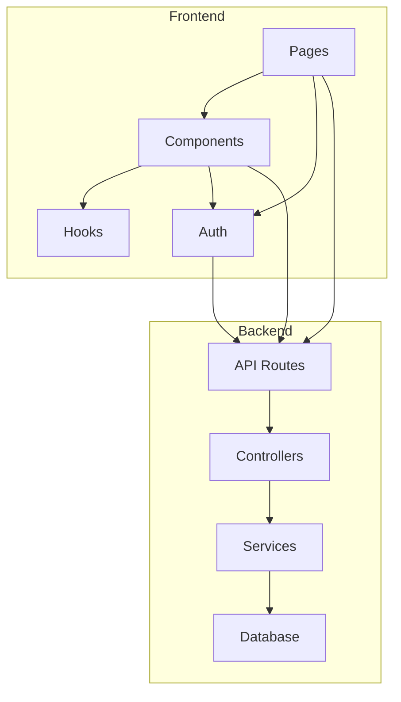
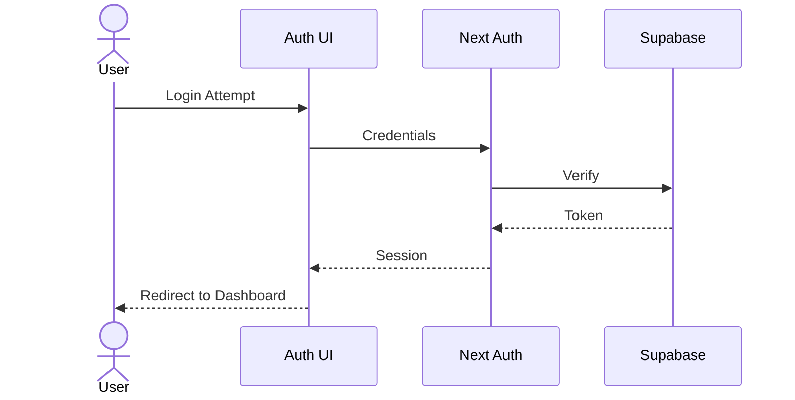
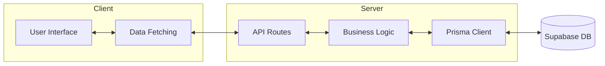

# System Patterns

## Architecture Overview



## Directory Structure
```
src/
├── app/                    # Next.js app directory
│   ├── api/               # API routes
│   ├── (auth)/           # Authentication routes
│   ├── dashboard/        # Dashboard pages
│   └── layout.tsx        # Root layout
├── components/            # React components
│   ├── auth/             # Auth components
│   ├── dashboard/        # Dashboard components
│   ├── forms/            # Form components
│   └── ui/               # UI components
├── lib/                   # Utility functions
│   ├── prisma/           # Prisma client & configs
│   └── supabase/         # Supabase client & configs
├── hooks/                # Custom React hooks
├── types/                # TypeScript types
└── styles/               # Global styles
```

## Key Patterns

### Authentication Flow


### Data Flow


## Implementation Patterns

### API Routes
- REST-style endpoints
- Route handlers in app/api directory
- Middleware for authentication
- Error handling middleware

### Authentication
- Next-Auth with Supabase adapter
- JWT token strategy
- Role-based access control
- Protected API routes and pages

### Database Access
- Prisma as ORM
- Repository pattern for data access
- Transaction support for complex operations
- Connection pooling

### Frontend State Management
- Server components for static data
- SWR for client-side data fetching
- Form state with react-hook-form
- Zustand for complex UI state

### Error Handling
- Global error boundary
- Typed API responses
- Consistent error format
- User-friendly error messages

### Testing Strategy
- Jest for unit tests
- React Testing Library for components
- Integration tests for API routes
- E2E tests with Playwright
